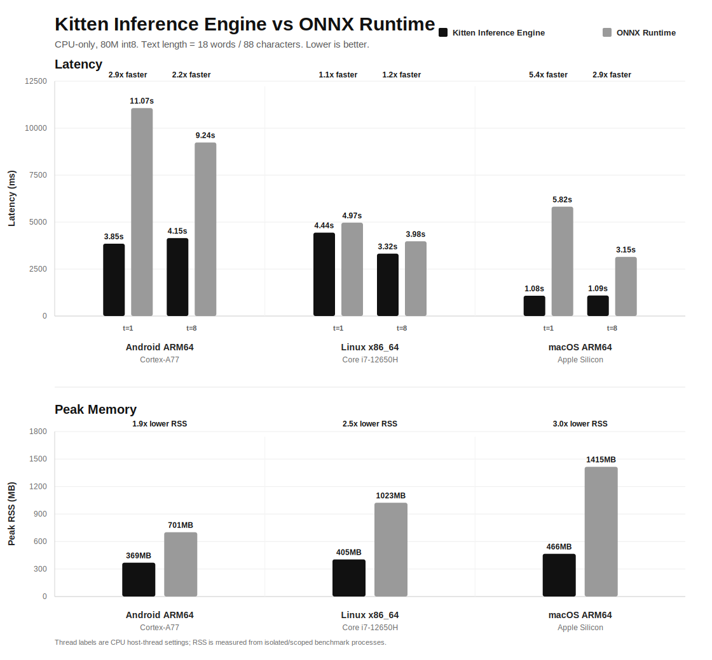

# Kitten TTS

<p align="center">
  
</p>

<p align="center">
  <a href="https://huggingface.co/spaces/KittenML/KittenTTS-Demo"></a>
  <a href="https://discord.com/invite/VJ86W4SURW"></a>
  <a href="https://kittenml.com"></a>
  <a href="LICENSE"></a>
</p>

> **New:** Kitten TTS v0.8.2 uses the Kitten Inference Engine (`kitten-inference`).

Kitten TTS is an open-source, lightweight text-to-speech library built on the Kitten Inference Engine. With models ranging from 15M to 80M parameters, it delivers high-quality voice synthesis on CPU wheels for Linux, Windows, Android/Termux, and Apple Silicon.

> **Status:** Developer preview -- APIs may change between releases.

**Commercial support is available.** For integration assistance, custom voices, or enterprise licensing, [contact us](https://docs.google.com/forms/d/e/1FAIpQLSc49erSr7jmh3H2yeqH4oZyRRuXm0ROuQdOgWguTzx6SMdUnQ/viewform?usp=preview).

## Table of Contents

- [Features](#features)
- [Available Models](#available-models)
- [Benchmarks](#benchmarks)
- [Demo](#demo)
- [Quick Start](#quick-start)
- [API Reference](#api-reference)
- [System Requirements](#system-requirements)
- [Roadmap](#roadmap)
- [Commercial Support](#commercial-support)
- [Community and Support](#community-and-support)
- [License](#license)

## Features

- **Ultra-lightweight** -- Model sizes from 25 MB (int8) to 80 MB, suitable for edge deployment
- **Kitten Inference Engine** -- C++ backend for Linux, Windows, Android, and Apple Silicon CPU/Metal
- **8 built-in voices** -- Bella, Jasper, Luna, Bruno, Rosie, Hugo, Kiki, and Leo
- **Stable Python API** -- The existing `KittenTTS(...).generate(...)` API remains in place
- **Text preprocessing** -- Built-in pipeline handles numbers, currencies, units, and more
- **24 kHz output** -- High-quality audio at a standard sample rate

## Available Models

| Model | Parameters | Size | Download |
|---|---|---|---|
| kitten-tts-mini | 80M | native weights | `KittenML/kitten-tts-mini-0.8` via [KittenML/meownn-models](https://huggingface.co/KittenML/meownn-models) |
| kitten-tts-mini (int8) | 80M | native weights | `KittenML/kitten-tts-mini-0.8-int8` via [KittenML/meownn-models](https://huggingface.co/KittenML/meownn-models) |
| kitten-tts-micro | 40M | native weights | `KittenML/kitten-tts-micro-0.8` via [KittenML/meownn-models](https://huggingface.co/KittenML/meownn-models) |
| kitten-tts-micro (int8) | 40M | native weights | `KittenML/kitten-tts-micro-0.8-int8` via [KittenML/meownn-models](https://huggingface.co/KittenML/meownn-models) |
| kitten-tts-nano | 15M | native weights | `KittenML/kitten-tts-nano-0.1` via [KittenML/meownn-models](https://huggingface.co/KittenML/meownn-models) |
| kitten-tts-nano (int8) | 15M | native weights | `KittenML/kitten-tts-nano-0.8-int8` via [KittenML/meownn-models](https://huggingface.co/KittenML/meownn-models) |

Built-in model aliases use packaged arch JSONs and download W1X1 weights plus voice styles from the native weights repository. Custom native model repositories may also publish `CPP1` configs; see [Native Engine Release](docs/native_engine_release.md).

## Benchmarks

CPU-only Kitten Inference Engine was benchmarked against ONNX Runtime with the
80M int8 model. Text length = 18 words / 88 characters.
Lower is better.

<p align="center">
  
</p>

| Host | Latency vs ONNX | Peak RSS vs ONNX |
|---|---:|---:|
| Android ARM64 / Cortex-A77 | 2.9x faster at `t=1`; 2.2x at `t=8` | 1.9x lower |
| Linux x86_64 / Core i7-12650H | 1.1x faster at `t=1`; 1.2x at `t=8` | 2.5x lower |
| macOS ARM64 / Apple Silicon | 5.4x faster at `t=1`; 2.9x at `t=8` | 3.0x lower |

`t=1` and `t=8` are CPU host-thread settings. The best setting varies by CPU;
both are shown for transparency. Data is from June 2026 benchmark runs; ONNX
uses the latest run with model rows when a newer run did not emit ONNX rows. No
CUDA or Metal backend results are included.

## Demo

https://github.com/user-attachments/assets/d80120f2-c751-407e-a166-068dd1dd9e8d

### Try it online

Try Kitten TTS directly in your browser on [Hugging Face Spaces](https://huggingface.co/spaces/KittenML/KittenTTS-Demo).

## Quick Start

### Installation

KittenTTS is a pure Python wheel for CPython 3.8+. It depends on
`kitten-inference`, which is published as platform-specific native wheels. Pip
selects the native wheel that matches your Python version, OS, and CPU.

```bash
pip install https://github.com/KittenML/KittenTTS/releases/download/0.8.2/kittentts-0.8.2-py3-none-any.whl
```

If pip reports that no `kitten-inference` distribution is available, use one of
the Python/platform combinations listed below or build the native engine wheel
from source.

Android / Termux:

```bash
pkg install -y python espeak libsndfile
python -m pip install --upgrade pip
python -m pip install https://github.com/KittenML/KittenTTS/releases/download/0.8.2/kittentts-0.8.2-py3-none-any.whl
```

For local release testing, put `kittentts-0.8.2-py3-none-any.whl` in Android
Downloads and replace the URL with:

```bash
termux-setup-storage
python -m pip install ~/storage/downloads/kittentts-0.8.2-py3-none-any.whl
```

| Target | Python | Engine wheel |
|---|---|---|
| Linux x86_64 CPU | CPython 3.8-3.14 | `kitten_inference-*-cp3*-cp3*-manylinux_*_x86_64.whl` |
| Windows x86_64 CPU | CPython 3.8-3.14 | `kitten_inference-*-cp3*-cp3*-win_amd64.whl` |
| macOS ARM64 / Apple Silicon CPU+Metal | CPython 3.8-3.14 | `kitten_inference-*-cp3*-cp3*-macosx_11_0_arm64.whl` |
| Android ARM64 / Termux | CPython 3.13 experimental | `kitten_inference-*-cp313-cp313-android_*_arm64_v8a.whl` |

Support notes:

- The native wheel set covers only the targets listed above.
- Not covered by the current wheels: Intel Mac, Linux ARM64, Windows ARM64, CUDA, and unusual Python/platform tags not present on the `kitten-inference` release.
- Older Android ARM64 devices without ARMv8.2 dot-product support have not been validated and may break.

### Basic Usage

```python
from kittentts import KittenTTS

model = KittenTTS("KittenML/kitten-tts-mini-0.8")
# Smaller old-model option:
# model = KittenTTS("KittenML/kitten-tts-nano-0.1")
audio = model.generate("This high-quality TTS model runs without a GPU.", voice="Jasper")

import soundfile as sf
sf.write("output.wav", audio, 24000)
```

### Advanced Usage

```python
# The speed argument is accepted for API compatibility.
# Current native Kitten graphs do not expose a speed input, so non-1.0 values are ignored.
audio = model.generate("Hello, world.", voice="Luna", speed=1.0)

# Save directly to a file
model.generate_to_file("Hello, world.", "output.wav", voice="Bruno", speed=1.0)

# List available voices
print(model.available_voices)
# ['Bella', 'Jasper', 'Luna', 'Bruno', 'Rosie', 'Hugo', 'Kiki', 'Leo']

# Apple Silicon Metal
metal_model = KittenTTS("KittenML/kitten-tts-mini-0.8", backend="metal")
```

## API Reference

### `KittenTTS(model_name, cache_dir=None, backend=None)`

Load a model from Hugging Face Hub or a local native model directory. `backend`
is optional; omit it for CPU, or pass `"metal"` on Apple Silicon.

| Parameter | Type | Default | Description |
|---|---|---|---|
| `model_name` | `str` | `"KittenML/kitten-tts-nano-0.1"` | Hugging Face repository ID or local native model directory |
| `cache_dir` | `str` | `None` | Local directory for caching downloaded model files |
| `backend` | `str` | `None` | `"cpu"` or `"metal"` on Apple Silicon; defaults to CPU |

### `model.generate(text, voice, speed, clean_text)`

Synthesize speech from text, returning a NumPy array of audio samples at 24 kHz.

| Parameter | Type | Default | Description |
|---|---|---|---|
| `text` | `str` | -- | Input text to synthesize |
| `voice` | `str` | `"expr-voice-5-m"` | Voice name (see available voices) |
| `speed` | `float` | `1.0` | Accepted for API compatibility; native graphs currently ignore non-1.0 values |
| `clean_text` | `bool` | `False` | Preprocess text (expand numbers, currencies, etc.) |

### `model.generate_to_file(text, output_path, voice, speed, sample_rate, clean_text)`

Synthesize speech and write directly to an audio file.

| Parameter | Type | Default | Description |
|---|---|---|---|
| `text` | `str` | -- | Input text to synthesize |
| `output_path` | `str` | -- | Path to save the audio file |
| `voice` | `str` | `"expr-voice-5-m"` | Voice name |
| `speed` | `float` | `1.0` | Accepted for API compatibility; native graphs currently ignore non-1.0 values |
| `sample_rate` | `int` | `24000` | Audio sample rate in Hz |
| `clean_text` | `bool` | `True` | Preprocess text (expand numbers, currencies, etc.) |

### `normalize_text(text, locale="en-US", return_spans=False)`

Normalize text for TTS without generating audio.

```python
from kittentts import normalize_text

normalized = normalize_text("Dr. Rivera paid $12.50 at 3:05 p.m.")
# "Doctor Rivera paid twelve dollars and fifty cents at three oh five p m."

result = normalize_text("Fig. 2", return_spans=True)
print(result.text)
print(result.spans)
```

When `return_spans=True`, the result includes original-to-normalized character spans for changed segments such as abbreviations, dates, times, numbers, currency, URLs, and punctuation.

### `model.available_voices`

Returns a list of available voice names: `['Bella', 'Jasper', 'Luna', 'Bruno', 'Rosie', 'Hugo', 'Kiki', 'Leo']`

## System Requirements

- **Operating system:** Linux x86_64, Windows x86_64, Android ARM64/Termux, or macOS ARM64/Apple Silicon for the current wheels
- **Python:** CPython 3.8+ for KittenTTS; the native `kitten-inference` wheel must match your Python version and platform
- **Hardware:** CPU by default; Metal on Apple Silicon with `backend="metal"`
- **Disk space:** Depends on the native model variant and weights bundle

The current wheel set is not a universal hardware claim. Older Intel/AMD CPUs,
Intel Macs, Linux ARM64, Windows ARM64, and older Android devices should be
treated as unvalidated unless a separate compatible wheel and smoke test are
provided.

A virtual environment (conda, venv, or similar) is recommended to avoid dependency conflicts.

## Roadmap

- [x] Release optimized inference engine
- [ ] Release mobile SDK
- [ ] Release higher quality TTS models
- [ ] Release multilingual TTS
- [ ] Release KittenASR
- [ ] Need anything else? [Let us know](https://github.com/KittenML/KittenTTS/issues)

## Commercial Support

We offer commercial support for teams integrating Kitten TTS into their products. This includes integration assistance, custom voice development, and enterprise licensing.

[Contact us](https://docs.google.com/forms/d/e/1FAIpQLSc49erSr7jmh3H2yeqH4oZyRRuXm0ROuQdOgWguTzx6SMdUnQ/viewform?usp=preview) or email info@stellonlabs.com to discuss your requirements.

## Community and Support

- **Discord:** [Join the community](https://discord.com/invite/VJ86W4SURW)
- **Website:** [kittenml.com](https://kittenml.com)
- **Custom support:** [Request form](https://docs.google.com/forms/d/e/1FAIpQLSc49erSr7jmh3H2yeqH4oZyRRuXm0ROuQdOgWguTzx6SMdUnQ/viewform?usp=preview)
- **Email:** info@stellonlabs.com
- **Issues:** [GitHub Issues](https://github.com/KittenML/KittenTTS/issues)

## License

This project is licensed under the [Apache License 2.0](LICENSE).
